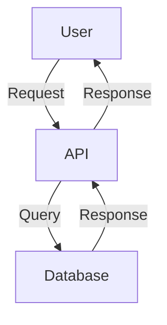

# Documentation Standards

## Overview

Guidelines for creating clear, maintainable documentation for **TODO: <project-name>**.

---

## Documentation Types

### 1. Code Documentation

**Purpose**: Explain complex logic, public APIs, and design decisions

**Format**: TODO: <doc-format> (e.g., JSDoc, Python docstrings, Javadoc, rustdoc)

**Example** (TODO: adapt to your language):
```
TODO: <code-doc-example>

/**
 * Calculates the total price including tax.
 *
 * @param price - The base price before tax
 * @param taxRate - The tax rate as a decimal (e.g., 0.1 for 10%)
 * @returns The total price including tax
 * @throws {Error} If price is negative or taxRate is invalid
 *
 * @example
 * calculateTotal(100, 0.1); // Returns 110
 */
function calculateTotal(price: number, taxRate: number): number {
  if (price < 0) throw new Error('Price cannot be negative');
  if (taxRate < 0 || taxRate > 1) throw new Error('Invalid tax rate');
  return price * (1 + taxRate);
}
```

### 2. README Files

**Purpose**: Provide project overview, setup, and quick start guide

**Sections**:
- Project name and description
- Features and use cases
- Installation and setup
- Usage examples
- Configuration
- Contributing guidelines
- License

**Template**: See root `README.md` for example

### 3. Architecture Documentation

**Purpose**: Explain system design, components, and interactions

**Location**: `docs/architecture/`

**Content**:
- High-level architecture diagrams
- Component interactions
- Data flow diagrams
- Technology choices and rationale

### 4. API Documentation

**Purpose**: Document endpoints, parameters, responses, and errors

**Format**: TODO: <api-doc-format> (e.g., OpenAPI/Swagger, API Blueprint, Markdown)

**Example**:
```
TODO: <api-doc-example>

## GET /users/:id

Retrieve a user by ID.

**Parameters**:
- `id` (path, required): User ID (integer)

**Response** (200 OK):
```json
{
  "id": 123,
  "name": "John Doe",
  "email": "john@example.com"
}
```

**Errors**:
- `404 Not Found`: User not found
- `500 Internal Server Error`: Server error
```

### 5. Dev-Docs (Task Documentation)

**Purpose**: Persist plans, context, and tasks across sessions

**Location**: `.claude/dev/active/<task-name>/`

**Files**:
- `<task-name>-plan.md`: Implementation plan, phases, acceptance criteria
- `<task-name>-context.md`: Key decisions, files, dependencies
- `<task-name>-tasks.md`: Checklist for tracking progress

**Usage**:
```bash
/dev-docs <task-name>        # Create task documentation
/dev-docs-update             # Update before context compaction
```

---

## Writing Style

### General Principles

- **Clarity**: Write for your audience (developers, users, stakeholders)
- **Conciseness**: Be brief but complete
- **Accuracy**: Keep docs in sync with code
- **Examples**: Include code examples and usage scenarios
- **Structure**: Use headings, lists, and formatting for readability

### Voice and Tone

- Use active voice: "The function calculates..." (not "is calculated by...")
- Use imperative for instructions: "Run the command..." (not "You should run...")
- Be direct and avoid filler words
- Use "we" for shared actions, "you" for user actions

### Formatting

- Use **bold** for emphasis and UI elements
- Use `code` for code snippets, commands, and file names
- Use > blockquotes for important notes
- Use lists for steps or multiple items
- Use tables for structured data

---

## Documentation Maintenance

### When to Update Docs

- **Code changes**: Update docs when APIs or behavior changes
- **New features**: Document new features immediately
- **Bug fixes**: Update docs if the bug was due to unclear documentation
- **Refactoring**: Update architecture docs if structure changes
- **Deprecations**: Mark deprecated features clearly

### Review Cycle

- **On PR**: Reviewer checks that docs are updated
- **Quarterly**: Review all docs for accuracy and completeness
- **On release**: Update changelog and version docs

### TODO Tracking

Mark incomplete docs with `TODO:` comments:
```
TODO: Add examples for error handling
TODO: Document new configuration options
TODO: Update architecture diagram
```

---

## Templates

### Feature Documentation Template

```markdown
# Feature: <Feature Name>

## Overview

<Brief description of what this feature does>

## Use Cases

- Use case 1
- Use case 2

## Usage

<Code examples showing how to use the feature>

## Configuration

<Any configuration options>

## Limitations

<Known limitations or edge cases>

## Examples

<Complete, runnable examples>

## See Also

- Related feature 1
- Related feature 2
```

### Architecture Decision Record (ADR) Template

```markdown
# ADR <number>: <Title>

**Date**: YYYY-MM-DD
**Status**: Proposed | Accepted | Deprecated | Superseded

## Context

<What is the issue or decision to be made?>

## Decision

<What decision was made?>

## Consequences

**Positive**:
- Benefit 1
- Benefit 2

**Negative**:
- Drawback 1
- Drawback 2

**Trade-offs**:
- Trade-off 1

## Alternatives Considered

- Alternative 1: <why rejected>
- Alternative 2: <why rejected>
```

---

## Tools and Automation

### Documentation Generation

TODO: Configure doc generation (e.g., TypeDoc, Sphinx, Javadoc, rustdoc)

**Command**:
```bash
TODO: <doc-gen-command>
```

### Diagram Tools

TODO: Choose diagramming tools (e.g., Mermaid, PlantUML, draw.io)

**Example (Mermaid)**:


### Link Checking

Ensure internal links are valid:
```bash
TODO: <link-check-command>
```

---

## Documentation Checklist

Before merging:
- [ ] All public APIs are documented
- [ ] README is up to date
- [ ] Architecture docs reflect current state
- [ ] Examples are tested and working
- [ ] No broken links
- [ ] Changelog updated (if applicable)

---

**Last Updated**: 2025-11-15
